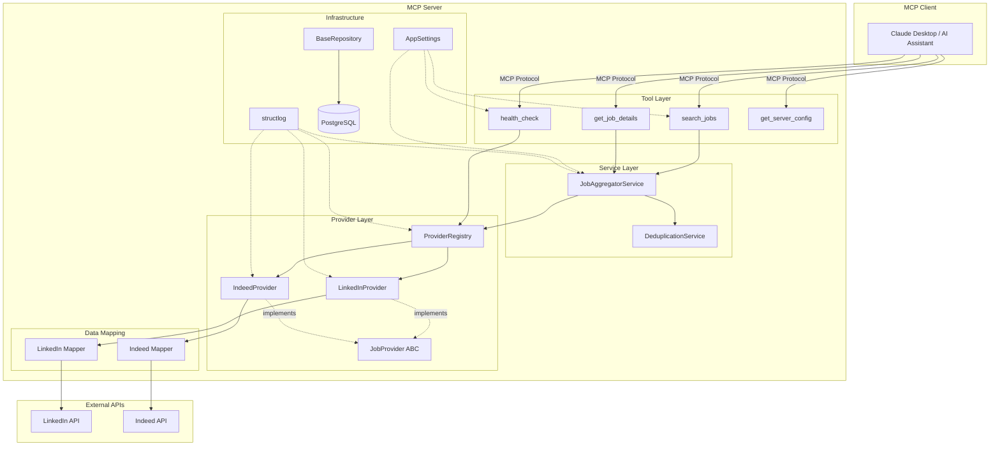
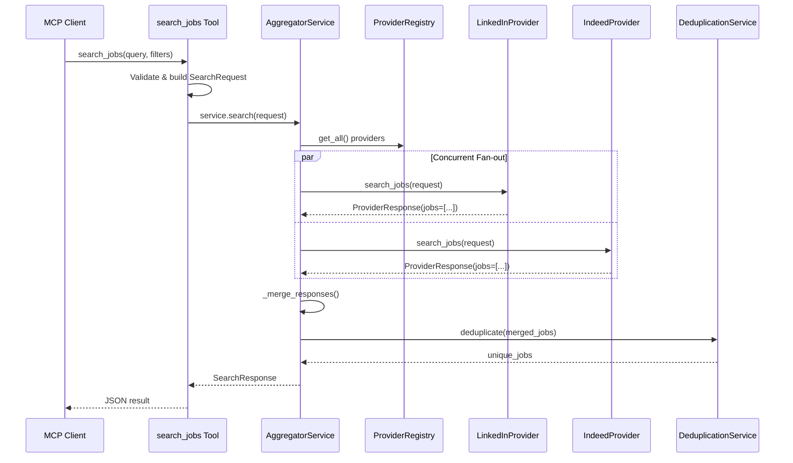

# Job Aggregator MCP Server - Architecture

## Overview

A production-grade MCP (Model Context Protocol) server that aggregates job listings from multiple providers (LinkedIn, Indeed) and exposes them as MCP tools for AI assistants like Claude Desktop. Built with Python 3.12, FastMCP, async/await, and clean architecture principles.

## System Architecture



## Component Details

### Tool Layer (`tools/`)

MCP tools are the public API surface. They validate input, delegate to services, and return structured JSON. No business logic lives here.

| Tool | Purpose |
|------|---------|
| `search_jobs` | Fan-out search across all providers with filters |
| `get_job_details` | Fetch a single job by provider-prefixed ID |
| `health_check` | Server + provider health status |
| `get_server_config` | Non-sensitive configuration info |

**DI approach**: Closure-based injection via `register_*_tools(mcp, service=...)` functions.

### Service Layer (`services/`)

- **JobAggregatorService**: Orchestrates concurrent fan-out to all providers via `asyncio.create_task` + `asyncio.wait`. Provider failures are isolated -- one provider down never takes down the search. Applies deduplication after merging results.
- **DeduplicationService**: Strategy pattern (`DedupStrategy` ABC). Default: `ExactMatchStrategy` keying on `company::title::location`. Designed for future embedding-based strategies.

### Provider Layer (`providers/`)

- **JobProvider (ABC)**: Defines the contract: `search_jobs()`, `get_job_details()`, `health_check()`, plus shared `apply_filters()` for client-side filtering.
- **ProviderRegistry**: Dict-based registry with concurrent `health_check_all()` via `asyncio.gather`.
- **LinkedInProvider / IndeedProvider**: Concrete implementations. Each delegates HTTP to its own client and data mapping to its own mapper. Provider-specific types never leak past this boundary.

### Data Mapping (`providers/*/mapper.py`)

Each provider has a dedicated mapper that converts raw API responses into the domain `Job` model. Mappers return `None` on bad records so one malformed response never crashes a search.

### Domain Models (`models/`)

Pydantic v2 models with strict validation:

- `Job`, `CompanyInfo`, `SalaryRange` -- core domain
- `SearchRequest`, `SearchResponse`, `ProviderResponse` -- search flow
- `HealthStatus` -- health check response
- Enums: `JobType`, `ExperienceLevel`, `LocationType`

### Database Layer (`db/`)

- **Tables**: `users`, `search_history`, `saved_jobs`, `audit_logs` (SQLAlchemy 2.0 declarative with PostgreSQL-specific types: UUID, JSONB, ARRAY)
- **BaseRepository[ModelT]**: Generic async repository with CRUD operations
- **Session management**: `init_db()`, `get_session()` async generator with commit/rollback

### Configuration (`config/`)

`pydantic-settings` with `.env` loading. `@lru_cache(maxsize=1)` singleton pattern for `get_settings()`.

### Logging (`core/`)

`structlog` with environment-aware rendering: console in development, JSON in production. All log calls use keyword arguments for structured output.

## Data Flow: Search Request



## Design Decisions

| Decision | Rationale |
|----------|-----------|
| Closure-based DI | Avoids framework overhead; tools capture dependencies via closures at registration time |
| Provider never raises | `_execute_provider` wraps every call -- partial results always returned |
| Strategy pattern for dedup | Swap algorithms (exact-match vs embeddings) without touching callers |
| Separate mapper modules | Provider-specific data structures stay isolated; domain models stay clean |
| SQLite test doubles | `Fake*Row` models mirror production tables with SQLite-compatible types for fast in-memory tests |
| Concurrent health checks | `asyncio.gather` in registry instead of sequential loop |
| Shared `apply_filters` on base | Eliminates duplication; providers call `self.apply_filters()` after collecting results |

## Directory Structure

```
src/job_aggregator/
    config/         # pydantic-settings, environment config
    core/           # structlog setup, shared utilities
    db/
        repositories/   # Generic BaseRepository[ModelT]
        tables.py       # SQLAlchemy ORM table definitions
        session.py      # Engine + session management
    models/         # Pydantic domain models (Job, Search, Health)
    providers/
        base.py         # JobProvider ABC + shared apply_filters
        registry.py     # Provider registry with concurrent health checks
        linkedin/       # Client, mapper, config, exceptions
        indeed/         # Client, mapper, config, exceptions
    services/
        aggregator.py   # Concurrent fan-out + merge
        dedup.py        # Strategy-pattern deduplication
    tools/
        search.py       # search_jobs, get_job_details MCP tools
        health.py       # health_check, get_server_config MCP tools
    server.py       # Composition root
tests/
    conftest.py     # Fixtures, MockProvider, Fake*Row models
    test_*.py       # 107 tests, 89% coverage
```
